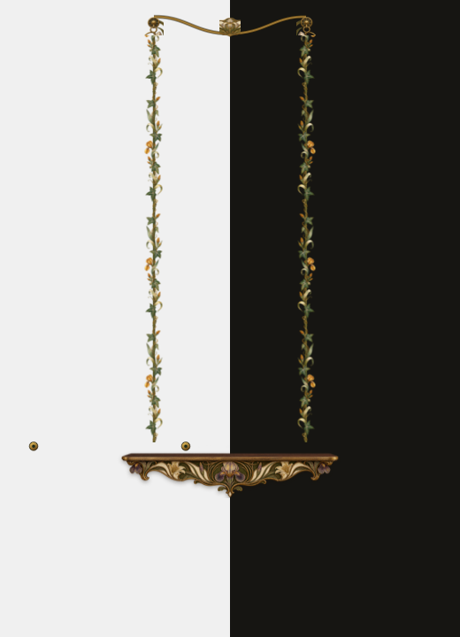

# 莉莉丝秋千

一个给 macOS Steam 桌宠游戏《不存在的莉莉丝》使用的轻量悬浮秋千。


## 特点

- 木质座板提供一条平直窗口上沿，让莉莉丝能够坐上去。
- 两条藤蔓会根据座板高度自动延伸到屏幕顶部，不再使用固定长度。
- 拖动座板时隐藏藤蔓，松开后藤蔓从顶部向下生长，减少画面突变。
- 独立皮肤引擎，将窗口行为与座板、藤蔓、顶部冠饰的渲染完全分离。
- 首套“穆夏 · 鸢尾”皮肤使用胡桃木、旧金、象牙珐琅、鸢尾与植物版画纹理。
- 装饰窗口保持窄或矮，避免被莉莉丝识别为额外落脚面。
- 菜单栏常驻，可选择皮肤、显示、隐藏、居中或退出；安装后支持登录自动启动。



## 使用

1. 运行 `./install.zsh`。
2. 直接拖动木质座板到想要的位置。
3. 双击座板可回到屏幕中央；右键座板或点击菜单栏的 `❧` 可打开菜单。

安装脚本会把应用放入 `~/Applications`，并创建当前用户的登录启动项。卸载时运行 `./uninstall.zsh`，相关文件会移到废纸篓。

## 手动构建

```sh
./build.zsh
```

构建结果位于 `build/莉莉丝秋千.app`。项目仅依赖 macOS 自带的 AppKit 和命令行开发工具。

生成皮肤的明暗背景预览：

```sh
./preview.zsh
```

## 皮肤结构

```text
SkinEngine/          皮肤协议、素材清单加载与注册表
Skins/
  Mucha/
    skin.json        名称、窗口指标、素材与裁切区域
    MuchaSkin.m      三类组件的排版与渲染
    Assets/          座板、顶部冠饰、可重复藤蔓素材
Tools/               独立皮肤预览渲染器
```

座板、藤蔓和顶部冠饰是三个明确的渲染组件。窗口管理、拖动和生长动画位于主程序，皮肤只决定指标与画面；新增皮肤不需要复制交互代码。详细约定见 [皮肤引擎说明](Docs/skin-engine.md)。

## 实现说明

莉莉丝会读取系统窗口边界来生成可站立或可坐的表面。应用因此将座板、藤蔓和顶部花饰拆成独立透明窗口：座板满足表面尺寸条件，而藤蔓与花饰至少有一个维度保持在游戏的最小窗口阈值以下。

当前版本以主屏幕为活动范围。
